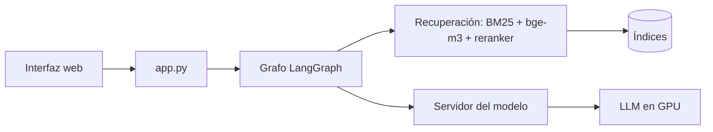

# LLM Law Learning Machine

## Equipo

**Nombre del equipo:** LLM Law Learning Machine

| Integrante | Código |
|---|---|
| Nicolás Baquero Ospino | 202124689 |
| David Briceño Estupiñan | 202311094 |
| Jessica Sofía Garay Acosta | 202310514 |

## Comando

Desde la raíz del repositorio, en PowerShell:

```powershell
powershell -ExecutionPolicy Bypass -File scripts\levantar_servidor.ps1
```

Instala las dependencias, valida que todo quedó instalado, levanta el servidor del modelo en
`http://127.0.0.1:8000/v1` y abre la interfaz web en `http://localhost:8080`.

## Dependencias

| Tipo | Qué se necesita |
|---|---|
| Sistema | Windows, Python 3.12 o 3.13, GPU NVIDIA con CUDA |
| Python | `requirements.txt` (el comando lo instala) |
| GPU | PyTorch con CUDA (el comando lo instala) |
| OCR | Tesseract (el comando lo instala) |
| Modelos | `BSC-LT/salamandra-7b-instruct`, `BAAI/bge-m3`, `BAAI/bge-reranker-v2-m3` (se descargan solos) |
| Datos | `corpus.db`, `index_sin_sentencias/`, `index_juris/` e `index_manifest.json` en `indices/` |

## Arquitectura



1. **Clasificar**: detecta el formato de la pregunta y las normas que menciona.
2. **Recuperar**: busca pasajes con BM25 y vectores (bge-m3), los fusiona y los reordena.
3. **Generar**: el LLM responde con los pasajes recuperados.
4. **Verificar**: revisa que cada cita tenga respaldo en los pasajes; si no hay evidencia, se abstiene.
