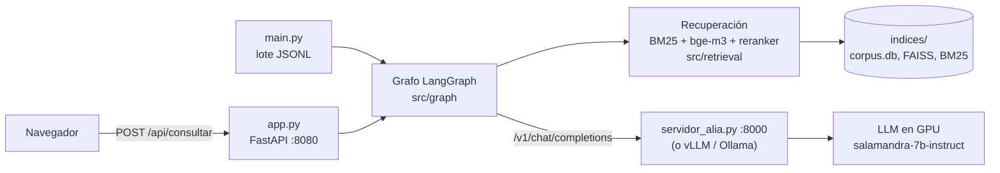
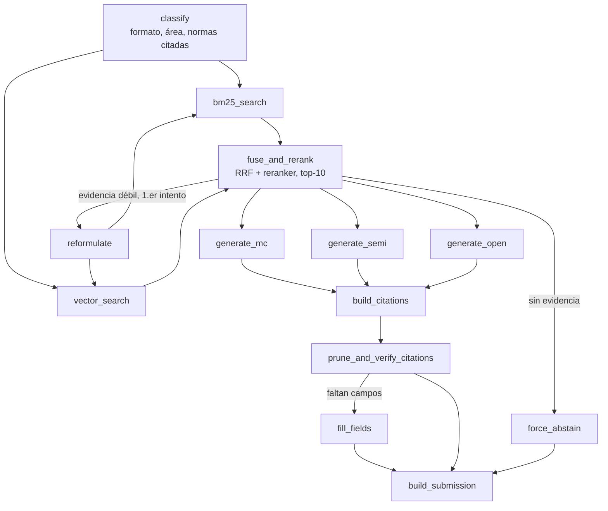

# LLM Law Learning Machine

**Para el equipo: [GUIA_EQUIPO.md](GUIA_EQUIPO.md)** (cómo correr todo, qué tocar, resultados).

RAG legal colombiano: un grafo de LangGraph (`src/graph/`) clasifica la pregunta, recupera de un
índice híbrido (BM25 + bge-m3, `src/retrieval/`), genera la respuesta con un LLM local servido con
API compatible con OpenAI y verifica que cada cita esté en los pasajes (`src/guards/`). Se usa por
lote (`main.py`) o pregunta a pregunta desde una interfaz web (`app.py`).

## Reproducción en un solo comando (Windows)

Desde la raíz del repo, en PowerShell:

```powershell
powershell -ExecutionPolicy Bypass -File scripts\levantar_servidor.ps1
```

El comando, en una sola función (`Levantar-Servidor`):

1. **Entorno**: crea `.venv` con Python 3.12 o 3.13 si no existe.
2. **Dependencias**: instala torch con CUDA (cu126), `requirements.txt` y Tesseract (con winget).
   `requirements-gpu.txt` (vLLM) se omite porque vLLM no existe para Windows.
3. **Validación**: `pip check`, importa cada paquete, busca el binario de Tesseract y comprueba
   que CUDA vea la GPU. Si algo falla se detiene y dice qué.
4. **Servidor del modelo** en esta terminal: `scripts/servidor_alia.py` en `http://localhost:8000/v1`
   (si ya hay uno respondiendo en ese puerto, lo usa).
5. **Interfaz web** en otra ventana, ya conectada al modelo: `app.py` en `http://localhost:8080`,
   y abre el navegador.

La primera vez descarga torch y las dependencias (unos 3 GB) y los modelos de Hugging Face
(unos 17 GB); las siguientes solo valida y levanta. Las dependencias que ya están no se reinstalan.

**Antes de correrlo:** Python 3.12 o 3.13, GPU NVIDIA con driver al día (`nvidia-smi`), internet y
los índices en `indices/` (ver [Datos](#datos)).

Variables opcionales (`$env:NOMBRE = "valor"` antes del comando):

| Variable | Por defecto | Para qué |
|---|---|---|
| `LLM_MODELO` | `BSC-LT/salamandra-7b-instruct` | modelo de Hugging Face o carpeta local |
| `ALIA_4BIT` | `0` | `1`: cargar el modelo en 4 bits (menos VRAM) |
| `PUERTO` | `8000` | puerto del servidor del modelo |
| `UI_PUERTO` | `8080` | puerto de la interfaz web |
| `SIN_GPU` | `0` | `1`: no exigir CUDA y correr en CPU (muy lento) |
| `VENV` | `.venv` | carpeta del entorno virtual (p. ej. `.venv-prueba` para probar desde cero) |

En Linux o Colab el equivalente es `bash scripts/levantar_servidor.sh` (sirve el modelo con vLLM)
o `bash run.sh`, que además corre el lote y la evaluación (ver [Otros comandos](#otros-comandos)).

## Arquitectura

Dos procesos que se hablan por HTTP: el servidor del modelo y la aplicación (interfaz web o lote),
que carga los índices y corre el grafo.



Recorrido de una pregunta por el grafo (`src/graph/workflow.py`):



- **classify** (`src/query/`): detecta el formato (selección múltiple, semiabierta, abierta), el área y
  las normas que nombra la pregunta.
- **Recuperación** (`src/retrieval/`): BM25 y búsqueda densa con `BAAI/bge-m3` en paralelo, fusión RRF y
  reordenamiento con `BAAI/bge-reranker-v2-m3`; los pasajes derogados bajan al final.
- **Reformulación y abstención** (`edges.py`): si la evidencia es débil se reintenta una vez con otra
  consulta; si sigue sin evidencia, el texto libre se abstiene.
- **Generación** (`src/generation/`): un generador por formato, con salida estructurada.
- **Guardas** (`src/guards/`): arman las citas desde los pasajes, quitan las que no tienen respaldo y
  completan los campos obligatorios antes de escribir la línea de la entrega.

## Dependencias

**Python** (`requirements.txt`):

| Grupo | Paquetes |
|---|---|
| Grafo y LLM | `langgraph`, `langchain-openai`, `pydantic`, `jsonschema` |
| Interfaz web | `fastapi`, `uvicorn[standard]` |
| Recuperación | `bm25s`, `rank-bm25`, `faiss-cpu`, `sentence-transformers`, `numpy` |
| Modelos | `transformers`, `accelerate`, `bitsandbytes`, `sentencepiece`, `protobuf`, `torch` (con CUDA) |
| Corpus | `requests`, `beautifulsoup4`, `pymupdf`, `pytesseract`, `Pillow`, `truststore` |
| Pruebas | `pytest` |

- `requirements-gpu.txt`: `vllm`, servidor alternativo del modelo, solo Linux con CUDA.
- `scripts/requirements-evaluador.txt`: lo que necesita el evaluador con juez.

**Sistema:** GPU NVIDIA con CUDA (probado en RTX 4090, 24 GB) y Tesseract OCR (solo para reconstruir
el corpus desde PDF).

**Modelos** (se descargan solos de Hugging Face la primera vez):

| Modelo | Uso |
|---|---|
| `BSC-LT/salamandra-7b-instruct` | generación (configurable con `LLM_MODELO`) |
| `BAAI/bge-m3` | vectores de la búsqueda densa (debe coincidir con el del índice) |
| `BAAI/bge-reranker-v2-m3` | reordenamiento de pasajes |

## Datos

`corpus.db`, `index_sin_sentencias/`, `index_juris/` e `index_manifest.json` van en `indices/`.
Pesan varios GB y no están en el repo; están en Drive, en `MyDrive/hackathon_vectorial`. `run.sh` los
baja solo si se define `INDICES_ZIP_URL`.

## Estructura

| Carpeta | Qué tiene |
|---|---|
| `src/query/` | `classifier.py`: formato, área y normas que nombra la pregunta |
| `src/retrieval/` | `resources.py` (índices cargados una vez), `rrf.py`, `reranker.py`, `buscar.py`, `texto.py` |
| `src/graph/` | `workflow.py`, `nodes.py`, `nodes_retrieval.py`, `edges.py`, `state.py` |
| `src/generation/` | `llm_engine.py`, `prompts.py`, `schemas.py` |
| `src/guards/` | abstención, armado y verificación de citas |
| `src/indexing/` | `build_index.py` (índices + `index_manifest.json`), `indexar.py`, `dense_encoder.py`, `eval_recuperacion.py`, `exportar_entrega.py` |
| `src/ingestion/` | descarga, limpieza y `corpus.db` (ver `src/ingestion/GUIA_DATOS.md`) |
| `src/ui/`, `app.py` | interfaz web: una pregunta suelta por el mismo grafo (`servicio.py`, `static/`) |
| `src/runner.py`, `main.py` | el lote: paralelo, reanudable, una línea por pregunta aunque falle |
| `scripts/` | `levantar_servidor.ps1`/`.sh` (comando único), `servidor_alia.py` (servidor del modelo), kit oficial del reto |
| `notebooks/` | `colab_pipeline.ipynb` (todo en Colab con Drive), `vectorial.ipynb` (vectores en GPU) |

## Otros comandos

Con el entorno activado (`.\.venv\Scripts\Activate.ps1`) y el servidor del modelo arriba:

```powershell
$env:LLM_BASE_URL = "http://localhost:8000/v1"; $env:METODO_SALIDA = "texto"
python main.py --split sample --limite 5      # prueba rápida
python main.py --split test                   # las 992 -> outputs/submissions.jsonl
python -m pytest tests -q
```

En Linux, `bash run.sh` hace todo el lote en un comando: dependencias, índices, Ollama con
`qwen3:8b-q8_0`, `main.py` y `evaluate.py` (`SPLIT=test bash run.sh` para las 992).

## Interfaz web

```bash
python app.py                  # http://127.0.0.1:8080: escribir la pregunta y ver respuesta, normas y pasajes
python app.py --sin-denso      # solo BM25
python app.py --demo           # sin índices ni LLM, respuestas de ejemplo (para ver la interfaz)
```

Lanzada a mano, `app.py` necesita las mismas variables `LLM_BASE_URL`, `LLM_MODELO` y `METODO_SALIDA`
que el lote; el comando único ya se las pasa.

La pregunta entra por `runner.entrada` y `grafo.invoke`, igual que en `main.py`: la respuesta es la
misma línea del JSONL (más `latencia_ms`). La página muestra los top-10 pasajes (cuáles usó el modelo)
y las normas que `citations.extract` saca de la respuesta, marcadas como respaldadas o no por los
pasajes con el mismo criterio de `citations.score`. API: `POST /api/consultar`
`{"pregunta": ..., "formato": null|"multiple_choice"|"semi_open"|"open_ended", "opciones": {"A": ...}}`;
documentación en `/api/docs`. El formato y las opciones son opcionales: `classify` los detecta.
